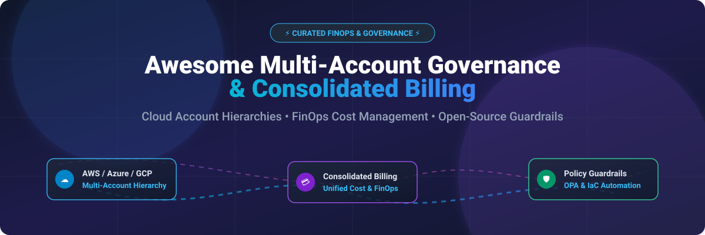

# ⚡ Awesome Multi-Account Governance & Consolidated Billing 💳

**Curated List of SaaS Platforms, Enterprise Cloud Tools & Open-Source GitHub Projects**

*Focused on AWS/Azure/GCP Account Hierarchies, Billing Consolidation, FinOps Cost Allocation & Cloud Policy Guardrails*

📅 **Last updated: October 2026**

---

## 📌 Overview & SEO Keywords

This curated directory tracks leading **cloud multi-account governance platforms**, **consolidated billing tools**, **FinOps cloud cost intelligence**, and **open-source policy automation tools**. Designed for Cloud Architects, DevOps Leaders, Platform Engineers, and FinOps Practitioners managing complex account hierarchies across Amazon Web Services (AWS), Microsoft Azure, and Google Cloud Platform (GCP).

---

## 🌐 SaaS / Hosted Platforms

> 📈 **Market Analysis & Industry Landscape**:
> The global Cloud Financial Management (FinOps) and Multi-Cloud Governance market is estimated at **$18.5 Billion (2026)** with a compound annual growth rate (CAGR) of 19.4%. The sector is **moderately fragmented**: hyper-scaler native services (AWS Organizations, Azure Management Groups, GCP Resource Hierarchy) control foundational hierarchy governance, while specialized independent SaaS vendors compete aggressively on cross-cloud FinOps intelligence, granular policy guardrails, and unit economics.

| SaaS / Platform 🚀 | Organization Size (Revenue / Valuation) 🏛️ | Specific Starting Price 💵 | Free Tier / Trial Limit 🎁 | Key Focus & Capabilities 🎯 |
| :--- | :--- | :--- | :--- | :--- |
| **[Azure Management Groups](https://azure.microsoft.com/en-us/products/management-groups/)** | $245B+ Annual Revenue | Free native service (Azure Enterprise Agreement required for enterprise billing) | 100% Free forever (Up to 10,000 management groups per directory) | Unified Azure subscription hierarchy, access control (RBAC), and policy enforcement across enterprise subscriptions. |
| **[Google Cloud Resource Hierarchy](https://cloud.google.com/resource-manager/docs/cloud-platform-resource-hierarchy)** | $307B+ Annual Revenue (Alphabet) | Free native service (Pay for underlying GCP resources used) | 100% Free forever for organization, folder, and project structure | Centralized policy control, IAM inheritance, and billing account aggregation across GCP projects. |
| **[AWS Organizations](https://aws.amazon.com/organizations/)** | $105B+ AWS Annual Revenue Segment | Free native service (Aggregates usage for volume tiering discounts) | 100% Free forever (Included with all AWS accounts) | Central management of AWS account hierarchies, consolidated billing, and Service Control Policies (SCPs). |
| **[Apptio Cloudability](https://www.apptio.com/products/cloudability/)** | Acquired by IBM for $4.6B Valuation | ~$499/month (Starter tier for up to $15K monthly cloud spend) | 14-day free trial (Full enterprise feature access) | Enterprise FinOps platform for cloud cost allocation, anomaly detection, rightsizing, and multi-cloud governance. |
| **[CloudBolt](https://www.cloudbolt.io/)** | ~$50M Revenue / Enterprise Private | ~$1,500/month starting enterprise tier | 30-day free trial (Limited to 100 managed cloud resources) | Hybrid cloud management platform combining cost visibility, compliance governance, and automated provisioning. |
| **[CloudZero](https://www.cloudzero.com/)** | ~$100M Valuation / Series B ($52M raised) | ~$1,000/month (Platform starting tier based on cloud spend) | 30-day free trial (Custom pilot on customer AWS/Azure/GCP accounts) | Cloud cost intelligence platform mapping cloud spend to unit economics, engineering teams, and product features. |
| **[Meshcloud](https://meshcloud.io/)** | ~$10M Annual Revenue | €900/month (Meshstack Starter Package) | 30-day free sandbox trial (Full multi-cloud tenant management) | Multi-cloud orchestrator providing self-service landing zones, automated tenant provisioning, and billing control. |
| **[Turbot Guardrails](https://turbot.com/)** | ~$15M Annual Revenue | $0.20 per resource per month (Pay-as-you-go) | 14-day free trial (Up to 500 cloud resources managed) | Enterprise real-time automated cloud governance, policy-as-code guardrails, and cross-account identity management. |
| **[CoreStack](https://www.corestack.io/)** | ~$20M Annual Revenue | $499/month (NextGen Cloud Governance starter tier) | 30-day free trial (Up to $10K cloud spend analyzed) | Continuous multi-cloud compliance, automated security posture, and FinOps cost optimization platform. |
| **[Gruntwork Pipelines](https://gruntwork.io/)** | ~$10M Annual Revenue | $399/month (Infrastructure as Code Subscription) | 14-day free trial (Access to Gruntwork Infrastructure Library) | Production-grade Terraform IaC modules for landing zones, multi-account AWS setups, and CI/CD pipelines. |

---

## 🛠️ Open-Source GitHub Projects

Below are top-tier open-source GitHub repositories for multi-account cloud governance, policy enforcement, IaC orchestration, and FinOps cost allocation.

| Open-Source Project 🐙 | GitHub_Stars_Badge ⭐ | License 📜 | Primary Governance & FinOps Use Case 💡 |
| :--- | :--- | :--- | :--- |
| **[Ansible](https://github.com/ansible/ansible)** |  | GPL-3.0 | Cross-account agentless configuration management and cloud provisioning. |
| **[Terraform](https://github.com/hashicorp/terraform)** |  | BSL-1.1 | Industry standard Infrastructure as Code for multi-account infrastructure provisioning. |
| **[OpenTofu](https://github.com/opentofu/opentofu)** |  | MPL-2.0 | Open-source fork of Terraform governed by the Linux Foundation for multi-account IaC. |
| **[Pulumi](https://github.com/pulumi/pulumi)** |  | Apache-2.0 | Code-first IaC platform supporting Python, TypeScript, Go, and C# across accounts. |
| **[Infracost](https://github.com/infracost/infracost)** |  | Apache-2.0 | Real-time cloud cost estimates for Terraform in pull requests before deploying resources. |
| **[Open Policy Agent (OPA)](https://github.com/open-policy-agent/opa)** |  | Apache-2.0 | General-purpose policy engine for cross-account compliance and Kubernetes guardrails. |
| **[Crossplane](https://github.com/crossplane/crossplane)** |  | Apache-2.0 | CNCF Kubernetes-native control plane orchestrating cloud resources across accounts. |
| **[Terragrunt](https://github.com/gruntwork-io/terragrunt)** |  | MIT | Thin wrapper for Terraform offering DRY configurations and multi-account orchestration. |
| **[Atlantis](https://github.com/runatlantis/atlantis)** |  | Apache-2.0 | GitOps workflow automation for Terraform via pull request comments. |
| **[Kyverno](https://github.com/kyverno/kyverno)** |  | Apache-2.0 | Kubernetes-native policy engine for cluster-wide governance and admission control. |
| **[Steampipe](https://github.com/turbot/steampipe)** |  | AGPL-3.0 | Zero-ETL SQL engine for querying cloud account resources, policies, and billing tables. |
| **[OpenCost](https://github.com/opencost/opencost)** |  | Apache-2.0 | CNCF standard specification and engine for real-time Kubernetes cost monitoring. |
| **[CloudQuery](https://github.com/cloudquery/cloudquery)** |  | MPL-2.0 | High-performance open-source cloud asset inventory ETL for SQL-based governance. |
| **[Cloud Custodian](https://github.com/cloud-custodian/cloud-custodian)** |  | Apache-2.0 | Lightweight rules engine for multi-account cloud security, compliance, and cost control. |
| **[Digger](https://github.com/diggerhq/digger)** |  | MIT | Open-source IaC orchestration engine designed to run inside existing CI/CD pipelines. |
| **[Gatekeeper](https://github.com/open-policy-agent/gatekeeper)** |  | Apache-2.0 | OPA-backed Kubernetes admission controller for enforcing enterprise compliance policies. |
| **[Terramate](https://github.com/terramate-io/terramate)** |  | MPL-2.0 | Code generation and stack orchestration tool for scaling Terraform/OpenTofu codebases. |

---

## 🧱 Architectural Patterns & DIY Frameworks

Organizations building custom multi-account governance and consolidated billing architectures can integrate these open-source tools into unified control planes:

- 📊 **Asset Inventory & Cost Exploration**: Query multi-account configurations with **[CloudQuery](https://github.com/cloudquery/cloudquery)** or **[Steampipe](https://github.com/turbot/steampipe)** using standard SQL.
- 💵 **Kubernetes & Cloud FinOps**: Deploy **[OpenCost](https://github.com/opencost/opencost)** for container cost tracking and **[Infracost](https://github.com/infracost/infracost)** to shift cost management left into CI/CD pipelines.
- 🛡️ **Automated Guardrails**: Enforce corporate compliance using **[Open Policy Agent](https://github.com/open-policy-agent/opa)** and scheduled cleanup policies with **[Cloud Custodian](https://github.com/cloud-custodian/cloud-custodian)**.
- 🏗️ **Infrastructure Deployment**: Orchestrate multi-region landing zones using **[Terragrunt](https://github.com/gruntwork-io/terragrunt)** or **[Terramate](https://github.com/terramate-io/terramate)** backed by **[OpenTofu](https://github.com/opentofu/opentofu)**.

---

## 🤝 How to Contribute

Contributions are welcome! Please follow these steps to add new tools or improve descriptions:

1. Fork this repository. 🍴
2. Create a new branch (`git checkout -b feature/add-new-tool`). 🌿
3. Add or update entries following the exact Markdown table structure.
4. Ensure factual accuracy for prices, trial limits, and star links.
5. Submit a Pull Request with a clear description of your changes. 🚀

---

## 💡 Support & Sponsorship

If you find this repository helpful for your cloud governance and FinOps journey, please consider supporting the project! 💖

- ⭐ **Star the repo**: Click the star button at the top right of this page to increase visibility.
- 🔀 **Fork & Share**: Share this list with fellow DevOps engineers and Cloud Architects.
- ☕ **Buy Me a Coffee / Sponsor**: Support ongoing maintenance via [GitHub Sponsors](https://github.com/sponsors/ishandutta2007).

---

## 📈 Star History

---

## ⚠️ Disclaimer

- This is a community-curated list and does not constitute official vendor endorsement.
- Cloud billing models and pricing change frequently; verify exact pricing on official vendor sites before making purchasing decisions.
- Always implement appropriate IAM security policies when granting cross-account read/write access to third-party tools.

---

  Made with ❤️ for FinOps Engineers, Platform Architects, and Cloud Practitioners worldwide.

